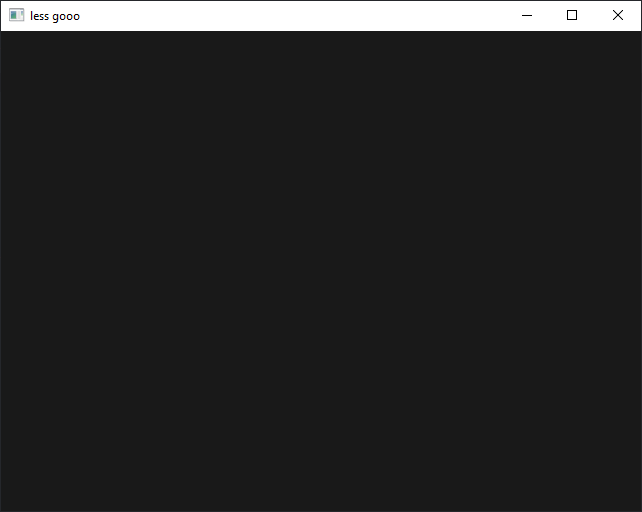

# Clearing the screen

Right now, your window probably doesn't show anything exciting yet. Let's change
that!

Use `glClear` and `glClearColor` to clear the framebuffer of your window using
the colour of your choice!

 _I went with some dark shade of grey._

## Links

- [OpenGL 4 Reference Pages][opengl-refpages] - the official documentation
- [docs.gl] - a nicer documentation, though unofficial

[opengl-refpages]: https://www.khronos.org/registry/OpenGL-Refpages/gl4/
[docs.gl]: http://docs.gl
