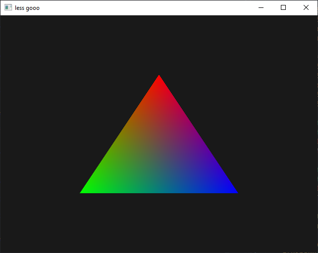

# Drawing the triangle

You should now have:

- A shader program that compiles and links
- A vertex array providing vertex data for each attribute used by your program

The only thing left to do is to draw the three vertices of the triangle using
the program and vertex array we prepared in the previous chapters. To do this,
you'll only need to use three functions:

- [`glUseProgram`], to specify the shader program
- [`glBindVertexArray`], to specify the vertex array
- [`glDrawArrays`], to draw the vertices!

> Up until now, everything went in the `init` callback function, because the
> program and vertex array only need to be created once. However, the triangle
> should be redrawn each frame, reusing the shader program and vertex array
> every time, so you will probably want to do that in the `render` callback
> function.

If you did everything right, you should now finally see the triangle show up!

 _Hello, Triangle!_

> If you don't see anything: don't worry! Most of us don't get things working
> right away on our first try. Check for errors using [`glGetError`], go back a
> few chapters, and do not hesitate to ask for help (you're probably not the
> only one)!

[`gluseprogram`]:
  https://www.khronos.org/registry/OpenGL-Refpages/gl4/html/glUseProgram.xhtml
[`glbindvertexarray`]:
  https://www.khronos.org/registry/OpenGL-Refpages/gl4/html/glBindVertexArray.xhtml
[`gldrawarrays`]:
  https://www.khronos.org/registry/OpenGL-Refpages/gl4/html/glDrawArrays.xhtml
[`glgeterror`]:
  https://www.khronos.org/registry/OpenGL-Refpages/gl4/html/glGetError.xhtml
