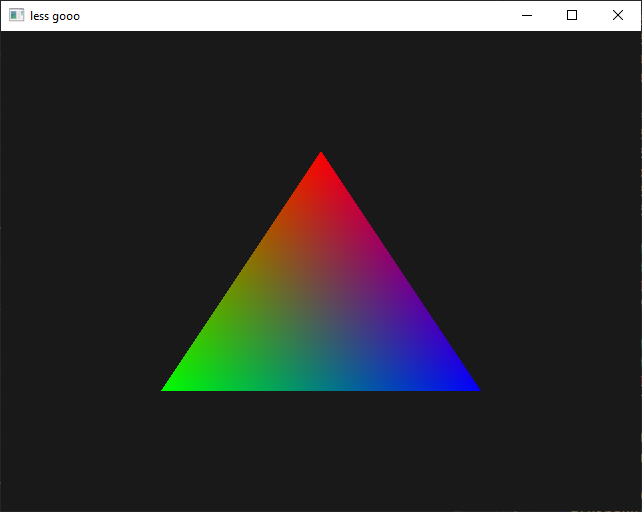

<!-- markdownlint-disable MD033 -->
<!-- markdownlint-disable MD041 -->

# Introduction

Welcome to my OpenGL workshop! This workshop will walk you through the very
basics of the modern OpenGL API (>= 3.3). By the end of it, you should have a
rough understanding of how the API is structured and how it can be used to
render simple hardware accelerated shapes.

## What's OpenGL?

OpenGL is a graphics API that gives you the power to use your video card for
graphical rendering. Without it, you would have to manually compute the colour
for every single pixel you would like to draw using the CPU. That's horrendously
slow, because you have to iterate through every single pixel one by one in
sequence!

Instead, many computers have a Graphical Processing Unit (GPU for short). It is
much more efficient because it's able to render different parts of your scene in
parallel! To be able to communicate with it in your programs, many different
APIs exist, each with a different set of capabilities and platform support.

The following table (that I just made up myself) summarises platform support for
the most common graphics APIs out there:

| Platform | OpenGL | Direct3D (DirectX) | Vulkan | Metal |
| -------: | :----: | :----------------: | :----: | :---: |
|  Windows |   ++   |        +++         |   ++   |   -   |
|    Linux |   ++   |         -          |  +++   |   -   |
|  Android |   ++   |         -          |  +++   |   -   |
|      Mac |   +    |         -          |  +\*   |  +++  |
|      iOS |   +    |         -          |  +\*   |  +++  |
|   Switch |   +    |         -          |   ++   |   -   |
|     Xbox |   -    |        +++         |   -    |   -   |

\*: non-official support through third-party software

> The name of the Xbox comes from DirectX (it's a "direct-X Box"). The
> PlayStation by Sony has its own proprietary API, and [the Nintendo Switch also
> supports NVN][switch-nvn], an API developed by NVIDIA.

## What are we making?

Most programmers begin to learn a new language or technology by writing a simple
"Hello, World!" program. In the world of low-level graphics programming, the
equivalent is the well known "RGB triangle":

 _Hello, Triangle!_

Being a low level API, OpenGL requires us to follow quite a bunch of steps in
order to reach our goal:

1. Create a shader program
2. Create a buffer containing vertex coordinates
3. Create a buffer containing vertex colours
4. Define a vertex array using the two buffers
5. Clear the screen
6. Draw 3 vertices using our shader program and vertex array

Don't worry, we'll go through each of those steps one by one!

[switch-nvn]:
  https://www.reddit.com/r/gamedev/comments/7jcugl/anyone_know_if_the_switch_has_its_own_graphics_api/
