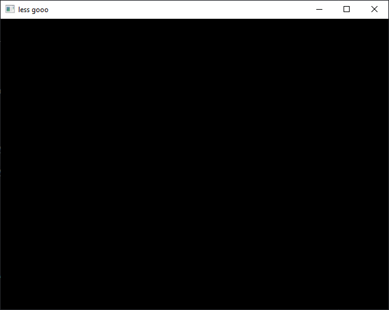

# Setup

> You can follow this workshop on Windows!

I have prepared [a repository](https://github.com/nasso/opengl-workshop)
containing several utilities that aren't relevant to this workshop (e.g. to open
a window, create an OpenGL context or load a bitmap file). This way, you'll be
focused on the important parts of today's workshop: OpenGL!

Clone it somewhere on your computer to get started:

```sh
git clone https://github.com/nasso/opengl-workshop.git
cd opengl-workshop
```

> You should have `cmake` installed (at least version 3.11).

Then try to build and run it!

```sh
cmake . -B build    # configure a CMake build in the `build/` directory
cmake --build build # build the executable
./main              # run it!
```

At this point, you should see an empty window appear!

 _An empty window!_

When modifying your code (in `src/main.c` for instance), you'll only have to
re-run the last two commands to see your changes:

```sh
cmake --build build # re-build (only necessary files)
./main              # re-run!
```

> You shouldn't have to re-configure! CMake should automatically re-configure
> the build when deemed necessary.
